# 🏗️ Flask Application Architecture - Complete Guide

> **Understanding how Flask works, request-response cycle, templates, and the complete application flow**

## 📋 Table of Contents

1. [What is Flask?](#-what-is-flask)
2. [Project Structure](#-project-structure)
3. [How Flask Works](#-how-flask-works)
4. [Request-Response Cycle](#-request-response-cycle)
5. [Templates & Jinja2](#-templates--jinja2)
6. [Database Integration](#-database-integration)
7. [Static Files](#-static-files)
8. [Complete Application Flow](#-complete-application-flow)
9. [Key Concepts](#-key-concepts)

---

## 🎯 What is Flask?

**Flask is a lightweight Python web framework** that helps you build web applications.

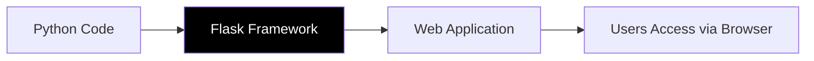

### Why Flask?

- ✅ **Simple** - Easy to learn and use
- ✅ **Flexible** - Not opinionated, you decide structure
- ✅ **Lightweight** - Minimal core, add what you need
- ✅ **Perfect for APIs** - RESTful API support
- ✅ **Template Engine** - Built-in Jinja2
- ✅ **Development Server** - Built-in for testing

---

## 📁 Project Structure

```
Flask/
├── app.py                 ← Main application (THE BRAIN)
├── config.py              ← Configuration settings
├── database.py            ← Database operations
├── .env                   ← Secret keys & API keys
│
├── templates/             ← HTML files (Jinja2 templates)
│   ├── index.html         ← Landing page
│   ├── chat.html          ← Chat interface
│   └── settings.html      ← Settings page
│
├── static/                ← CSS, JS, images
│   ├── css/
│   ├── js/
│   └── images/
│
├── uploads/               ← User uploaded files
└── flask_chat.db          ← SQLite database
```

### Role of Each File

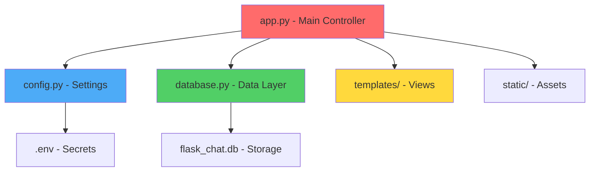

---

## 🧠 How Flask Works

### The Core Concept: Routes

**Route = URL pattern + Python function**

```python
@app.route('/hello')
def hello():
    return 'Hello, World!'
```

**When user visits `/hello`, Flask runs `hello()` function.**

### Flask Application Lifecycle

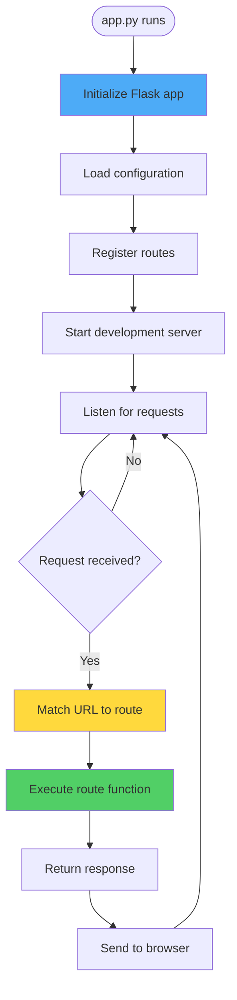

---

## 🔄 Request-Response Cycle

### Complete Flow with Your App

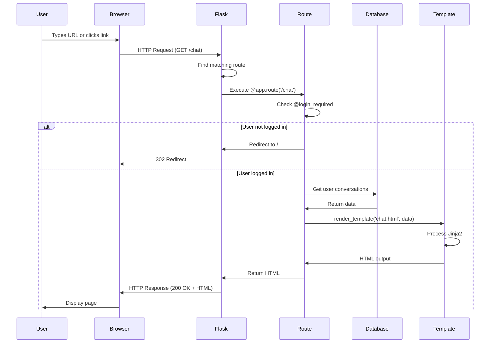

### Breaking Down the Request

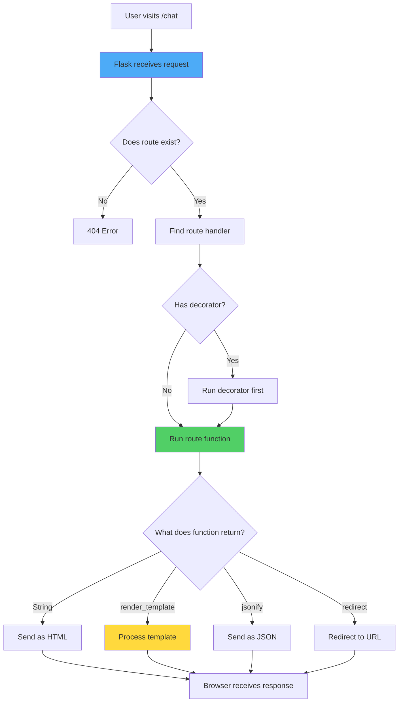

---

## 🎨 Templates & Jinja2

### What is `render_template()`?

**`render_template()` = Take HTML file + Add Python data = Complete webpage**

```python
@app.route('/chat')
def chat():
    user = session.get('user')
    conversations = get_user_conversations(user_id)
    
    # Flask finds templates/chat.html
    # Injects user and conversations data
    # Returns complete HTML
    return render_template('chat.html', 
                         user=user,
                         conversations=conversations)
```

### How Templates Work

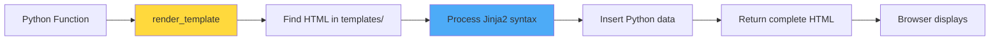

### Jinja2 Template Engine

**Jinja2 allows Python-like code in HTML:**

```html
<!-- templates/chat.html -->
<!DOCTYPE html>
<html>
<head>
    <title>Chat - {{ user.name }}</title>
</head>
<body>
    <h1>Welcome, {{ user.name }}!</h1>
    
    
        <ul>
        
            <li>{{ conv.title }}</li>
        
        </ul>
    
        <p>No conversations yet.</p>
    
</body>
</html>
```

**Jinja2 Syntax:**
- `{{ variable }}` - Output variable
- `` - Conditional logic
- `` - Loops
- `` - Include other templates

### Template Inheritance

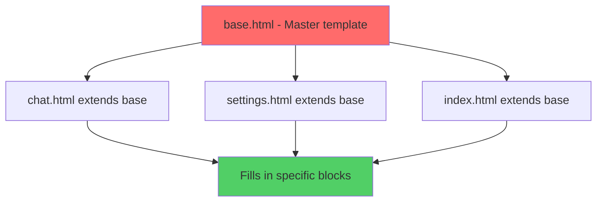

**Example:**

```html
<!-- templates/base.html -->
<!DOCTYPE html>
<html>
<head>
    <title></title>
</head>
<body>
    
    
</body>
</html>

<!-- templates/chat.html -->


Chat


    <h1>Chat Interface</h1>
    <!-- Chat content here -->

```

---

## 💾 Database Integration

### How Flask Talks to Database

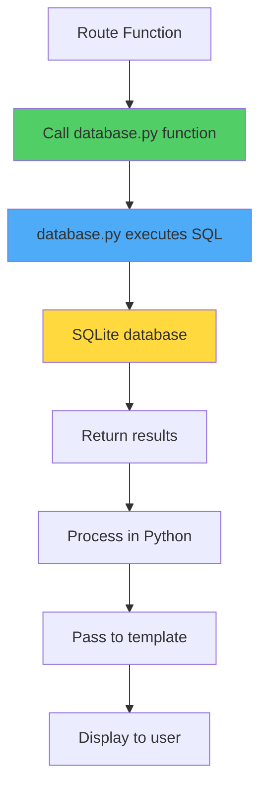

### Example Flow

```python
# app.py
@app.route('/chat')
def chat():
    user_id = get_user_id_by_google_id(user['google_id'])  # database.py
    conversations = get_user_conversations(user_id)         # database.py
    return render_template('chat.html', conversations=conversations)

# database.py
def get_user_conversations(user_id):
    cursor.execute('SELECT * FROM conversations WHERE user_id = ?', (user_id,))
    return cursor.fetchall()
```

### Database Operations Flow

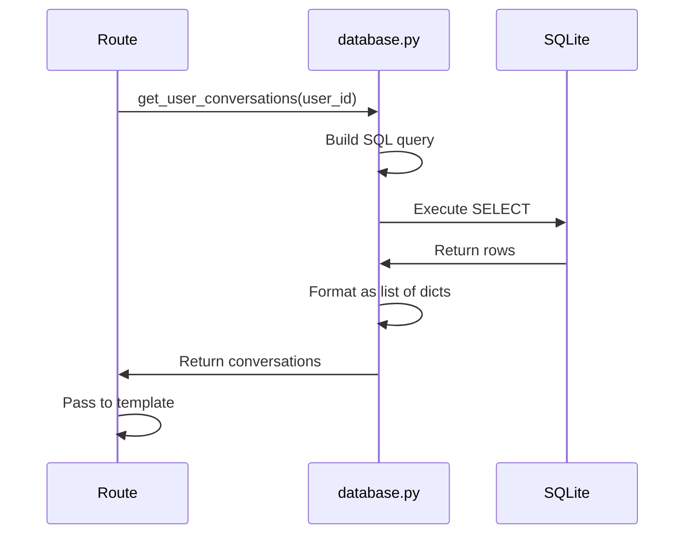

---

## 🎨 Static Files

### How Flask Serves Static Files

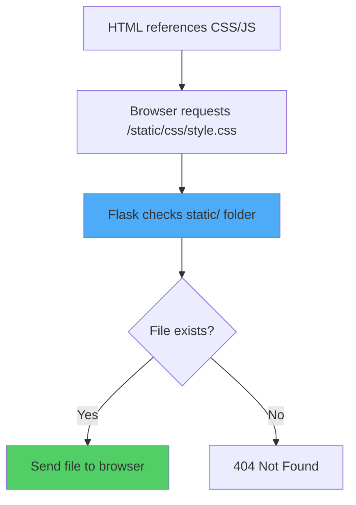

### In Templates

```html
<!-- Use url_for() for static files -->
<link rel="stylesheet" href="{{ url_for('static', filename='css/style.css') }}">
<script src="{{ url_for('static', filename='js/chat.js') }}"></script>

```

**Flask automatically serves `/static/` without a route!**

---

## 🔄 Complete Application Flow

### High-Level Architecture

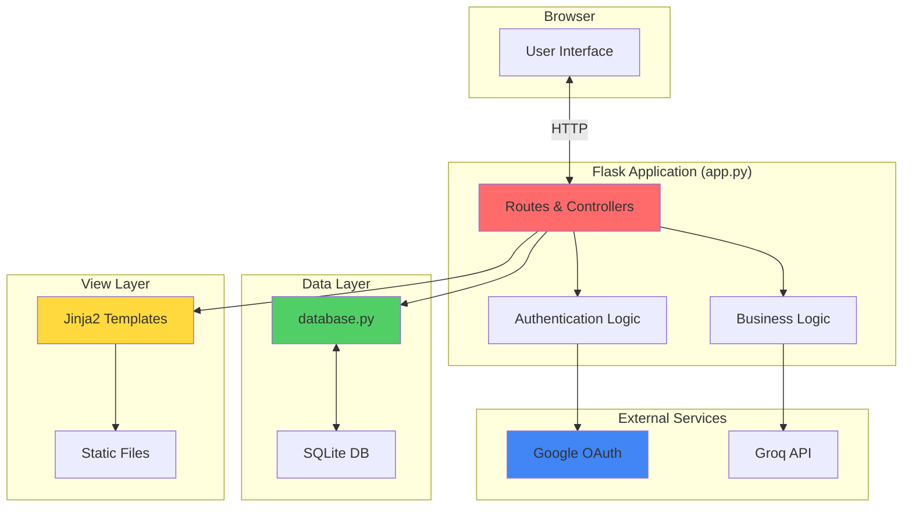

### Request Processing Pipeline

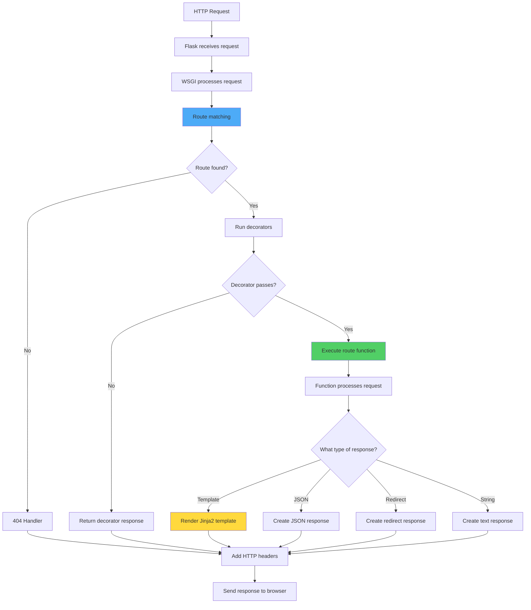

---

## 🎯 app.py: The Central Controller

### Why app.py is the Brain

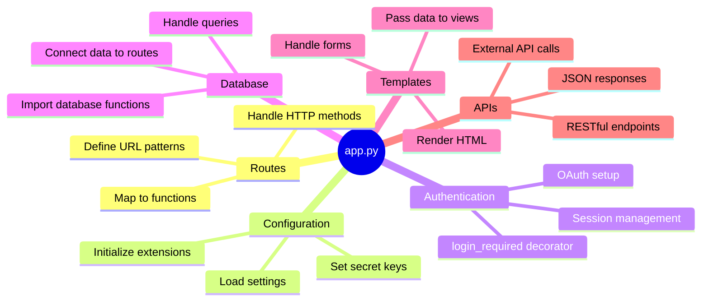

### app.py Structure

```mermaid
flowchart TD
    A[Imports] --> B[Initialize Flask]
    B --> C[Load Configuration]
    C --> D[Setup Extensions]
    D --> E[Define Routes]
    E --> F[Error Handlers]
    F --> G[Run Server]
    
    subgraph Routes["Route Definitions"]
        E1[/ - Landing]
        E2[/login - OAuth]
        E3[/chat - Interface]
        E4[/api/chat - AI]
    end
    
    E --> Routes
    
    style B fill:#ff6b6b
    style E fill:#51cf66
```

---

## 🔑 Key Concepts Explained

### 1. The Flask App Object

```python
app = Flask(__name__)  # Create Flask application
```

**This object is THE application. Everything revolves around it.**

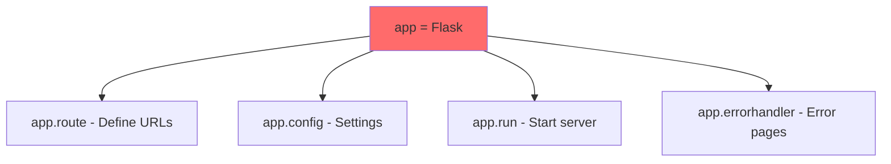

### 2. Decorators

**Decorators modify function behavior:**

```python
@app.route('/chat')      # 1. Tell Flask this handles /chat
@login_required          # 2. Check authentication first
def chat():              # 3. Then run this function
    return render_template('chat.html')
```

**Execution order:**

```mermaid
flowchart TD
    A[Request to /chat] --> B[@app.route matches]
    B --> C[@login_required runs]
    C --> D{Authenticated?}
    D -->|No| E[Redirect to /]
    D -->|Yes| F[Run chat function]
    F --> G[Return template]
    
    style C fill:#ffd93d
    style F fill:#51cf66
```

### 3. Request Context

**Flask provides automatic access to request data:**

```python
from flask import request, session

@app.route('/api/chat', methods=['POST'])
def api_chat():
    # Access request data
    user_message = request.get_json()['message']  # From POST body
    user_file = request.files.get('file')         # Uploaded file
    
    # Access session data
    user = session.get('user')                    # Session cookie
    
    return jsonify({'response': 'Hello'})
```

### 4. Response Types

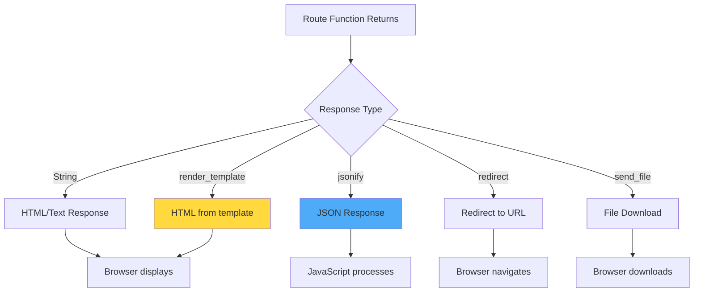

---

## 🎭 Example: Complete Request Flow

### User Sends Chat Message

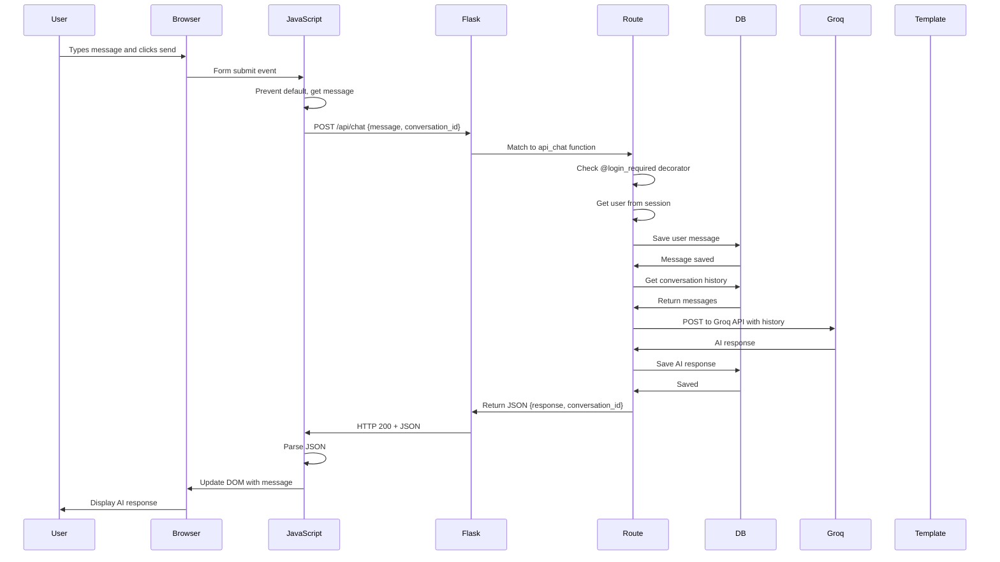

### Code Breakdown

```python
# 1. Frontend sends request
// JavaScript
fetch('/api/chat', {
    method: 'POST',
    headers: {'Content-Type': 'application/json'},
    body: JSON.stringify({message: 'Hello', conversation_id: 1})
})

# 2. Flask receives and routes
@app.route('/api/chat', methods=['POST'])
@login_required  # Decorator checks authentication
def api_chat():
    # 3. Get data from request
    data = request.get_json()
    user = session.get('user')
    
    # 4. Database operations
    user_id = get_user_id_by_google_id(user['google_id'])
    add_message(conversation_id, 'user', data['message'])
    
    # 5. External API call
    response = requests.post('https://api.groq.com/...')
    ai_response = response.json()['choices'][0]['message']['content']
    
    # 6. Save AI response
    add_message(conversation_id, 'assistant', ai_response)
    
    # 7. Return JSON
    return jsonify({'response': ai_response, 'conversation_id': conversation_id})

# 8. JavaScript updates UI
// JavaScript
.then(response => response.json())
.then(data => {
    displayMessage(data.response);
});
```

---

## 📊 HTTP Methods in Flask

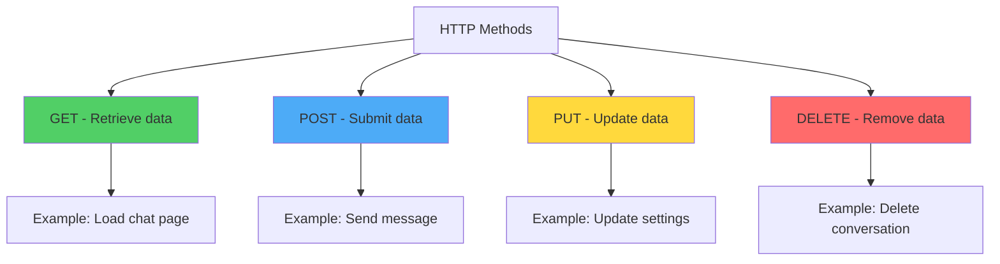

### In Flask Routes

```python
# GET - Default method
@app.route('/chat')
def chat():
    return render_template('chat.html')

# POST only
@app.route('/api/chat', methods=['POST'])
def api_chat():
    data = request.get_json()
    return jsonify({'response': 'Got it'})

# Multiple methods
@app.route('/api/conversations/<int:id>', methods=['GET', 'PUT', 'DELETE'])
def conversation(id):
    if request.method == 'GET':
        return get_conversation(id)
    elif request.method == 'PUT':
        return update_conversation(id)
    elif request.method == 'DELETE':
        return delete_conversation(id)
```

---

## 🚀 Flask Development Server

### How it Works

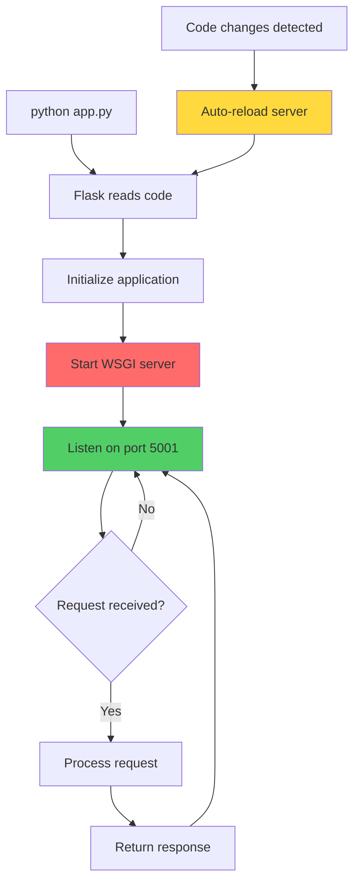

### Running Flask

```python
if __name__ == '__main__':
    app.run(
        debug=True,        # Auto-reload on code changes
        host='0.0.0.0',   # Listen on all network interfaces
        port=5001         # Port number
    )
```

**Debug mode features:**
- ✅ Auto-reloads when code changes
- ✅ Shows detailed error pages
- ✅ Interactive debugger in browser
- ⚠️ Never use in production!

---

## 🎓 Summary: Key Takeaways

```mermaid
flowchart TD
    A[Flask Application] --> B[Routes map URLs to functions]
    A --> C[Templates render HTML with data]
    A --> D[Database stores persistent data]
    A --> E[Static files serve CSS/JS/images]
    A --> F[Sessions manage user state]
    
    B --> G[Decorators add functionality]
    C --> H[Jinja2 processes templates]
    D --> I[database.py handles queries]
    E --> J[Served automatically]
    F --> K[Encrypted cookies]
    
    style A fill:#ff6b6b
    style B fill:#51cf66
    style C fill:#ffd93d
    style D fill:#4dabf7
```

### The Flask Triangle

```mermaid
flowchart LR
    A[Routes in app.py] --> B[Process request]
    B --> C[Query database.py]
    C --> D[Get data]
    D --> E[Pass to template]
    E --> F[Render HTML]
    F --> G[Return to browser]
    
    style A fill:#ff6b6b
    style C fill:#51cf66
    style E fill:#ffd93d
```

---

## 💡 Quick Reference

### Common Flask Patterns

| Pattern | Code | Purpose |
|---------|------|--------|
| **Define Route** | `@app.route('/path')` | Map URL to function |
| **Render Template** | `render_template('page.html', data=data)` | Generate HTML |
| **Get Form Data** | `request.form.get('field')` | Access form input |
| **Get JSON Data** | `request.get_json()` | Parse JSON body |
| **Return JSON** | `jsonify({'key': 'value'})` | Send JSON response |
| **Redirect** | `redirect(url_for('function_name'))` | Navigate to route |
| **Flash Message** | `flash('Message', 'category')` | Show user message |
| **Get Session** | `session.get('key')` | Access session data |
| **Set Session** | `session['key'] = value` | Store session data |
| **Get URL Parameter** | `@app.route('/user/<int:id>')` | Dynamic URL |

---

## 🎯 Understanding Your App

**Your Flask app is a pipeline:**

```
Browser Request → Flask Routes → Database Operations → External APIs → Template Rendering → Browser Response
```

**app.py is the conductor:**
- 🎭 Receives all requests
- 🎯 Routes to correct handler
- 🔐 Checks authentication
- 💾 Talks to database
- 🌐 Calls external APIs
- 🎨 Renders templates
- 📤 Sends responses

**Everything flows through app.py!**

---

**You now understand how Flask works end-to-end!** 🎉

Use these diagrams to explain your application architecture! 🚀
