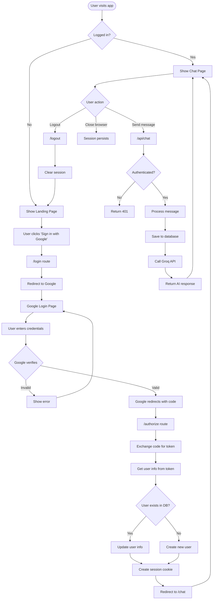
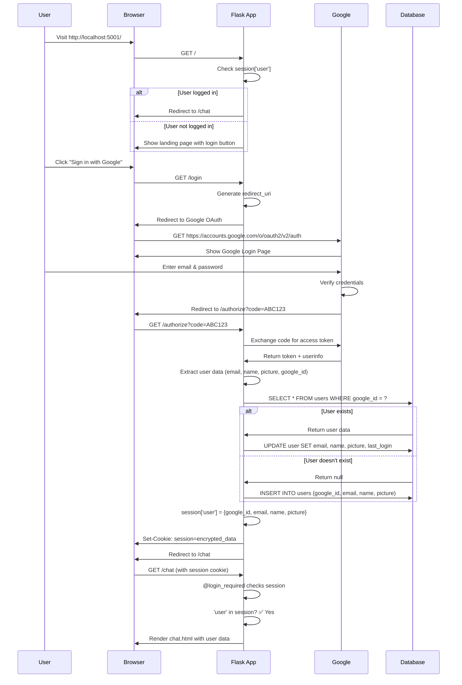
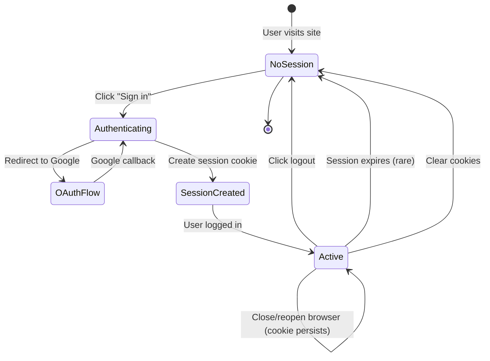
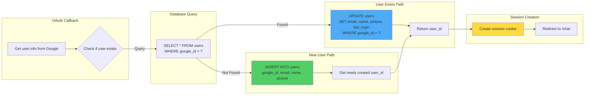
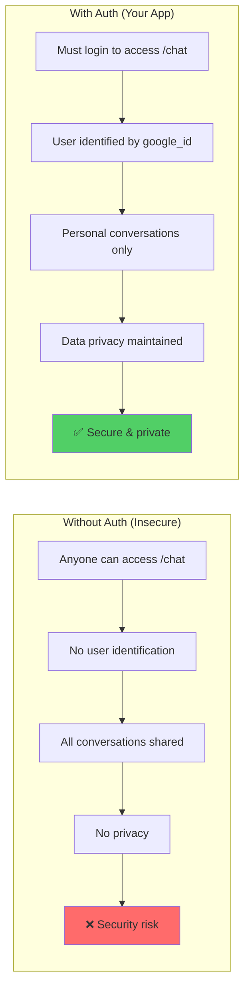
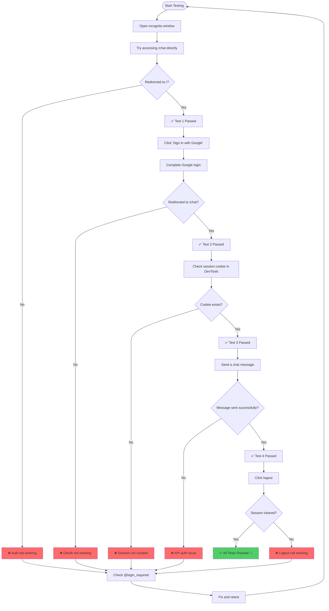
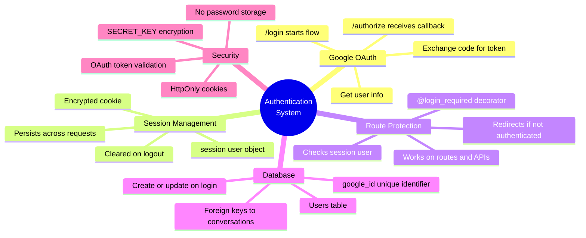
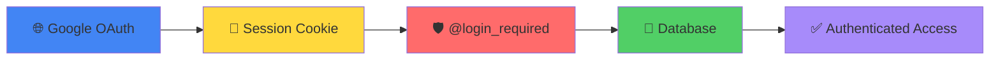

# 🎨 Google OAuth Authentication - Visual Flowcharts

## 📊 Complete Authentication Flow (High-Level)



---

## 🔐 Detailed OAuth Flow (Technical)



---

## 🛡️ Authentication Guard (@login_required) Flow

```mermaid
flowchart TD
    Start([User requests protected route]) --> Decorator[@login_required decorator runs]
    
    Decorator --> CheckSession{Is 'user' in session?}
    
    CheckSession -->|No| Flash[Flash warning message]
    Flash --> RedirectHome[Redirect to /]
    RedirectHome --> ShowLogin[Show login page]
    
    CheckSession -->|Yes| ExtractUser[Extract user from session]
    ExtractUser --> RunFunction[Execute route function]
    RunFunction --> ReturnResponse[Return page/data to user]
    
    style CheckSession fill:#ff6b6b
    style RunFunction fill:#51cf66
    style RedirectHome fill:#ffd93d
```

---

## 🔄 Session Lifecycle



---

## 📡 API Chat Request Flow (with Authentication)

```mermaid
flowchart TD
    Start([User sends message]) --> Frontend[Frontend JavaScript]
    Frontend --> PrepareData[Prepare request data]
    PrepareData --> SendRequest[POST /api/chat]
    
    SendRequest --> FlaskReceives[Flask receives request]
    FlaskReceives --> CheckAuth{@login_required}
    
    CheckAuth -->|No session| Return401[Return 401 Unauthorized]
    Return401 --> ShowError[Show error to user]
    
    CheckAuth -->|Has session| ExtractUser[Extract user from session]
    ExtractUser --> GetUserID[Get user_id from database]
    GetUserID --> ValidateConv{Conversation ID provided?}
    
    ValidateConv -->|No| CreateConv[Create new conversation]
    ValidateConv -->|Yes| CheckOwner{User owns conversation?}
    
    CheckOwner -->|No| Return403[Return 403 Forbidden]
    CheckOwner -->|Yes| UseExisting[Use existing conversation]
    
    CreateConv --> SaveMessage[Save user message to DB]
    UseExisting --> SaveMessage
    
    SaveMessage --> GetHistory[Get conversation history]
    GetHistory --> BuildPrompt[Build messages array for AI]
    BuildPrompt --> CallGroq[Call Groq API]
    
    CallGroq --> ReceiveResponse[Receive AI response]
    ReceiveResponse --> SaveAI[Save AI message to DB]
    SaveAI --> ReturnJSON[Return JSON to frontend]
    ReturnJSON --> DisplayMessage[Display in chat UI]
    
    style CheckAuth fill:#ff6b6b
    style CallGroq fill:#4dabf7
    style SaveMessage fill:#51cf66
```

---

## 🗄️ Database Operations During Auth



---

## 🎯 Route Protection Mechanism

```mermaid
flowchart TD
    subgraph "Public Routes (No Auth Required)"
        A1[/ - Landing page]
        A2[/login - Start OAuth]
        A3[/authorize - OAuth callback]
    end
    
    subgraph "Protected Routes (@login_required)"
        B1[/chat - Chat interface]
        B2[/settings - Settings page]
        B3[/api/chat - Send message]
        B4[/api/conversations - Get conversations]
        B5[/logout - End session]
    end
    
    subgraph "Session Check"
        C{session['user']<br/>exists?}
    end
    
    A1 --> NoAuth[Accessible to everyone]
    A2 --> NoAuth
    A3 --> NoAuth
    
    B1 --> C
    B2 --> C
    B3 --> C
    B4 --> C
    B5 --> C
    
    C -->|Yes| Allow[✅ Allow access]
    C -->|No| Block[❌ Redirect to /]
    
    style A1 fill:#51cf66
    style A2 fill:#51cf66
    style A3 fill:#51cf66
    style B1 fill:#ff6b6b
    style B2 fill:#ff6b6b
    style B3 fill:#ff6b6b
    style Allow fill:#51cf66
    style Block fill:#ff6b6b
```

---

## 🍪 Session Cookie Flow

```mermaid
flowchart TD
    subgraph "Login Process"
        A[User authenticates via Google] --> B[Flask receives user info]
        B --> C[Create session dictionary]
        C --> D["session['user'] = {<br/>google_id, email, name, picture<br/>}"]
    end
    
    subgraph "Flask Session Handling"
        D --> E[Serialize to JSON]
        E --> F[Encrypt with SECRET_KEY]
        F --> G[Base64 encode]
    end
    
    subgraph "Browser"
        G --> H[Set-Cookie header]
        H --> I[Browser stores cookie]
        I --> J[Cookie sent with every request]
    end
    
    subgraph "Subsequent Requests"
        J --> K[Flask receives Cookie header]
        K --> L[Decode Base64]
        L --> M[Decrypt with SECRET_KEY]
        M --> N[Deserialize JSON]
        N --> O["session['user'] available<br/>in Python code"]
    end
    
    O --> P{Route needs auth?}
    P -->|Yes| Q[@login_required checks session]
    P -->|No| R[Execute route normally]
    
    style D fill:#4dabf7
    style F fill:#ffd93d
    style I fill:#51cf66
    style O fill:#51cf66
```

---

## 🔄 Complete User Journey (First Time User)


---

## 🔐 Security Layers Visualization

```mermaid
flowchart TB
    subgraph "Layer 1: OAuth (Google)"
        A[Google verifies user identity]
        A1[No password stored in your app]
        A2[User can revoke access anytime]
    end
    
    subgraph "Layer 2: Session Encryption"
        B[Session data encrypted with SECRET_KEY]
        B1[Cookie signed to prevent tampering]
        B2[HttpOnly flag prevents JS access]
    end
    
    subgraph "Layer 3: Route Protection"
        C[@login_required decorator]
        C1[Checks session before every protected route]
        C2[Blocks unauthenticated requests]
    end
    
    subgraph "Layer 4: Database Security"
        D[User lookup by google_id (not email)]
        D1[Permanent identifier]
        D2[Foreign key constraints]
    end
    
    subgraph "Layer 5: API Validation"
        E[Verify user owns resources]
        E1[Check conversation ownership]
        E2[Validate user_id matches session]
    end
    
    A --> B
    B --> C
    C --> D
    D --> E
    E --> F[✅ Secure Access Granted]
    
    style F fill:#51cf66
```

---

## 🎭 Comparison: With vs Without Authentication



---

## 🧪 Testing Authentication Flow



---

## 📊 Data Flow: User Login to First Message

```mermaid
flowchart TD
    A[User clicks login] --> B[/login route]
    B --> C[Redirect to Google]
    C --> D[Google authenticates]
    D --> E[/authorize callback]
    
    E --> F[Exchange code for token]
    F --> G[Get user info]
    G --> H[Query database]
    
    H --> I{User exists?}
    I -->|No| J[INSERT INTO users]
    I -->|Yes| K[UPDATE users]
    
    J --> L[Get user_id]
    K --> L
    
    L --> M["session['user'] = {...}"]
    M --> N[Redirect to /chat]
    N --> O[Load chat interface]
    
    O --> P[User types message]
    P --> Q[POST /api/chat]
    Q --> R[@login_required]
    R --> S[Get user from session]
    S --> T[Get user_id from DB]
    T --> U[Create/get conversation_id]
    U --> V[INSERT message into DB]
    V --> W[Call Groq API]
    W --> X[Save AI response to DB]
    X --> Y[Return to frontend]
    Y --> Z[Display in chat]
    
    style M fill:#ffd93d
    style R fill:#ff6b6b
    style W fill:#4dabf7
    style Z fill:#51cf66
```

---

## 🎯 Quick Reference: Authentication Checkpoints



---

## 📝 Summary Diagram



---

**All these diagrams visually explain your authentication system!** 🎨

The flowcharts show:
- ✅ Complete OAuth flow
- ✅ Session management
- ✅ Route protection
- ✅ Database operations
- ✅ Security layers
- ✅ Testing procedures

**View on GitHub with proper Mermaid rendering!** 🚀
