# 🎨 Google OAuth Authentication - Visual Flowcharts

## 📊 Complete Authentication Flow (High-Level)

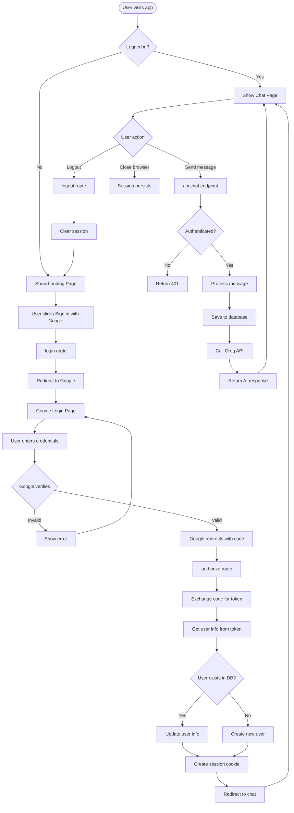

---

## 🔐 Detailed OAuth Flow (Technical)

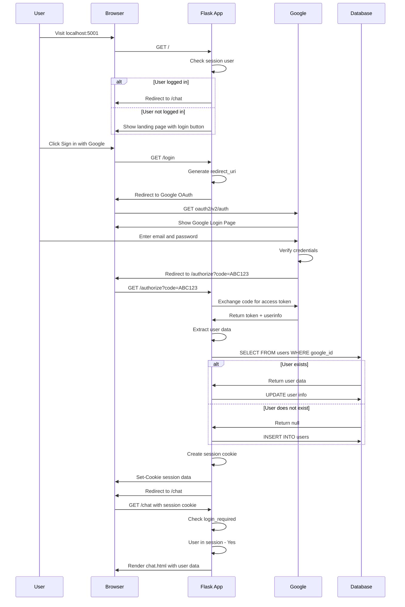

---

## 🛡️ Authentication Guard Flow

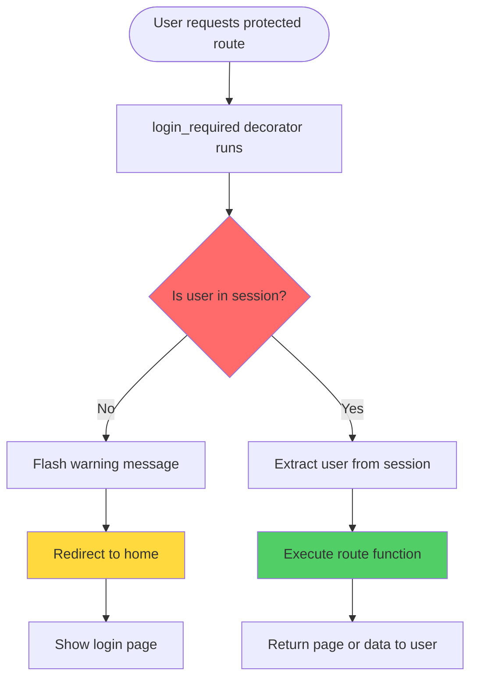

---

## 🔄 Session Lifecycle

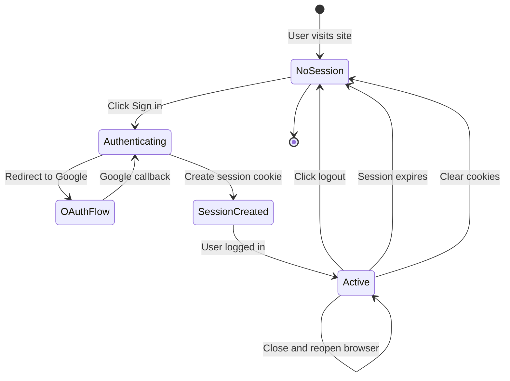

---

## 📡 API Chat Request Flow

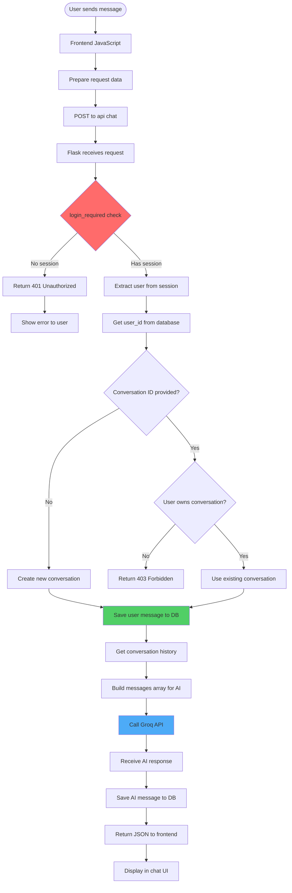

---

## 🗄️ Database Operations During Auth

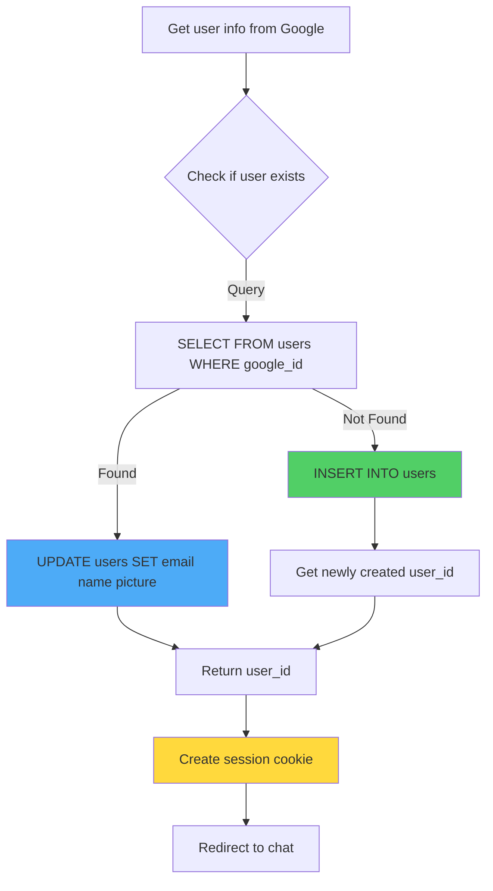

---

## 🎯 Route Protection Mechanism

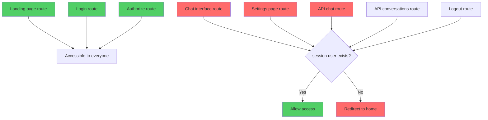

---

## 🍪 Session Cookie Flow

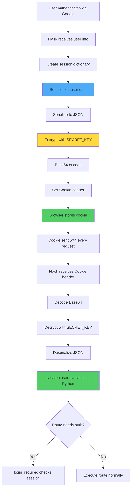

---

## 🔄 User Journey Map

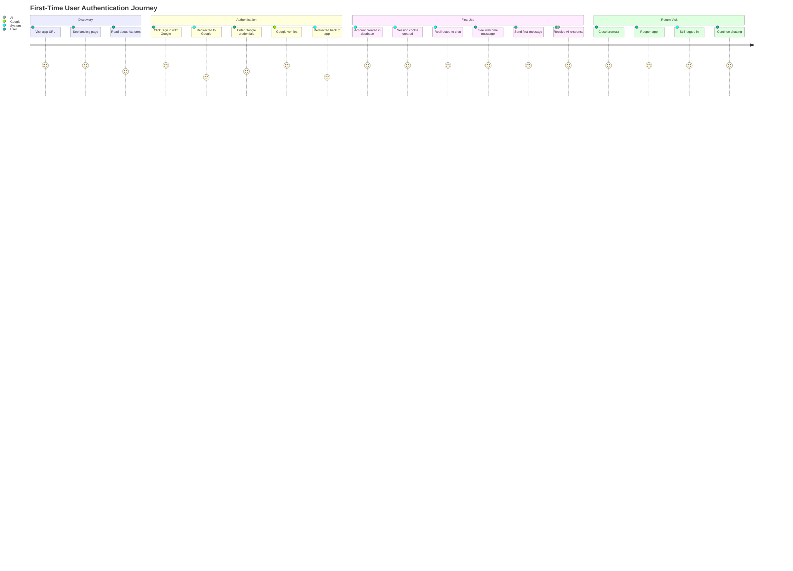

---

## 🔐 Security Layers

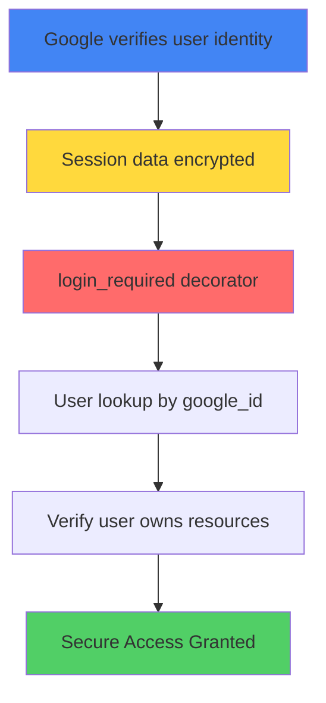

---

## 🎭 With vs Without Authentication

```mermaid
flowchart TD
    subgraph Without["Without Auth - Insecure"]
        N1[Anyone can access chat]
        N1 --> N2[No user identification]
        N2 --> N3[All conversations shared]
        N3 --> N4[No privacy]
        N4 --> N5[Security risk]
    end
    
    subgraph With["With Auth - Your App"]
        Y1[Must login to access chat]
        Y1 --> Y2[User identified by google_id]
        Y2 --> Y3[Personal conversations only]
        Y3 --> Y4[Data privacy maintained]
        Y4 --> Y5[Secure and private]
    end
    
    style N5 fill:#ff6b6b
    style Y5 fill:#51cf66
```

---

## 🧪 Testing Authentication

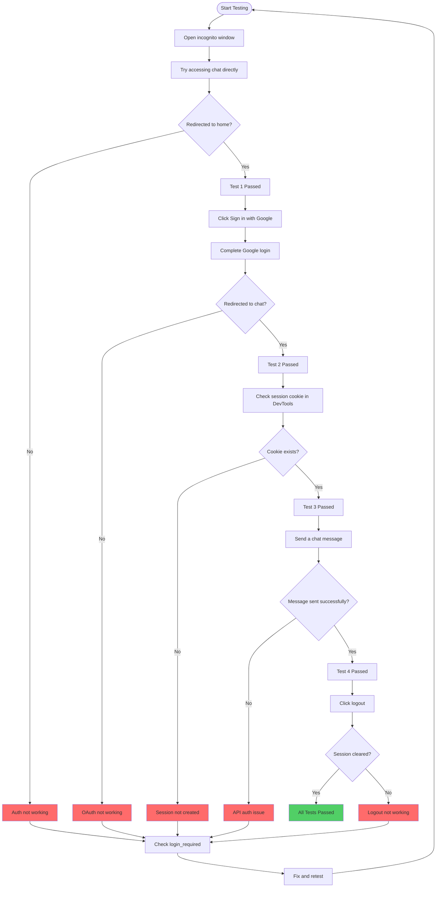

---

## 📊 Login to First Message Flow

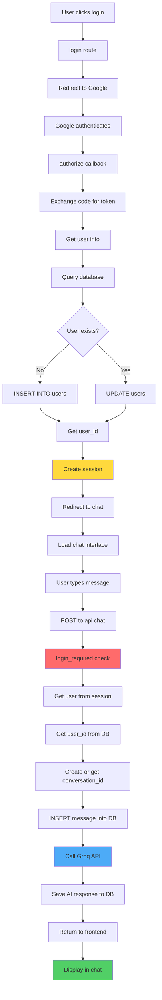

---

## 🎯 Authentication System Overview

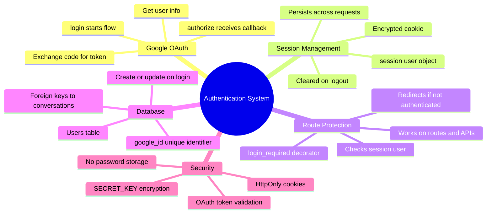

---

## 📝 Summary

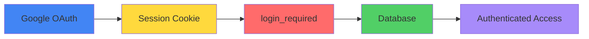

---

## 🎨 Key Points

**These flowcharts visually explain your authentication system:**

- ✅ Complete OAuth flow from login to chat
- ✅ Session management and cookies
- ✅ Route protection with decorators
- ✅ Database operations during auth
- ✅ Security layers and validation
- ✅ Testing procedures step-by-step
- ✅ User journey from discovery to return visits

**All diagrams use proper Mermaid syntax and should render correctly on GitHub!** 🚀

---

## 💡 Tips for Viewing

1. **Best view:** On GitHub - diagrams render automatically
2. **VS Code:** Install "Markdown Preview Mermaid Support" extension
3. **Local:** Use any Mermaid-compatible Markdown viewer

**GitHub will render all these diagrams beautifully!** ✨
