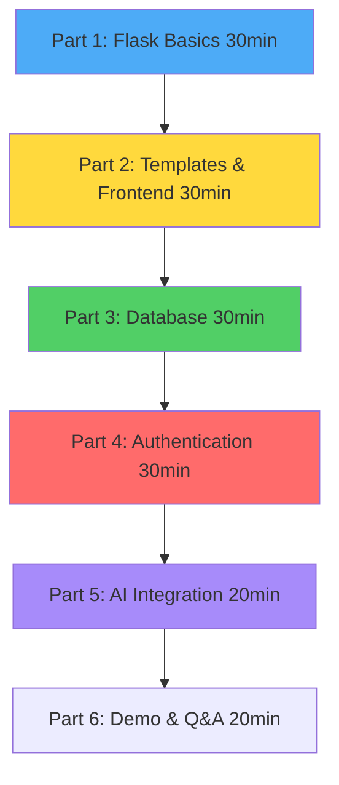

# 🎓 Flask AI Chat Workshop - Complete Guide

> **Step-by-step guide for teaching Flask web development with live coding**

## 📋 Workshop Overview

**Duration:** 2-3 hours
**Level:** Beginner to Intermediate
**Goal:** Build a Flask app from scratch while explaining concepts

### What Students Will Learn

- ✅ Flask basics (routes, templates, static files)
- ✅ Frontend with Tailwind CSS / Bootstrap
- ✅ Database operations with SQLite
- ✅ Google OAuth authentication
- ✅ API integration (Groq AI)
- ✅ Session management
- ✅ Full-stack development workflow

---

## 🎯 Workshop Structure



---

## 🚀 Pre-Workshop Setup

### For You (Presenter)

**1. Prepare Repository:**
```bash
# Clone your Flask app
git clone https://github.com/DANI-cloud-del/Flask.git
cd Flask

# Test that it works
python app.py
```

**2. Have Documentation Open:**
- [Workshop Guide](docs/WORKSHOP_GUIDE.md) (this file)
- [Workshop Cheat Sheet](docs/WORKSHOP_CHEATSHEET.md) (quick reference)
- [Flask Architecture](docs/FLASK_ARCHITECTURE.md) (for explanations)
- [OAuth Flowcharts](docs/OAUTH_FLOWCHART.md) (for visuals)

**3. Create New Workshop Folder:**
```bash
mkdir ~/Desktop/Flask-Workshop
cd ~/Desktop/Flask-Workshop
```

**4. Have AI Assistant Ready:**
- Keep this chat open
- Use for live coding help
- Reference the cheat sheet when needed

### For Students

**Prerequisites:**
- Python 3.8+ installed
- Text editor (VS Code recommended)
- Browser (Chrome/Firefox)
- Basic Python knowledge

**Installation:**
```bash
pip install flask authlib requests
```

---

## 📖 Part 1: Flask Basics (30 minutes)

### Goals
- Create minimal Flask app
- Understand routes
- Return HTML
- Run development server

### Step 1.1: Minimal Flask App (5 min)

**Create `app.py`:**
```python
from flask import Flask

app = Flask(__name__)

@app.route('/')
def home():
    return 'Hello, Flask Workshop!'

if __name__ == '__main__':
    app.run(debug=True, port=5001)
```

**Run it:**
```bash
python app.py
```

**Visit:** http://localhost:5001

**Explain:**
- `Flask(__name__)` - Creates app
- `@app.route('/')` - Maps URL to function
- `app.run(debug=True)` - Starts server with auto-reload

**Show:** [Flask Architecture - How Flask Works](docs/FLASK_ARCHITECTURE.md#-how-flask-works)

---

### Step 1.2: Multiple Routes (5 min)

**Add more routes to `app.py`:**
```python
@app.route('/')
def home():
    return 'Home Page'

@app.route('/about')
def about():
    return 'About Page'

@app.route('/user/<name>')  # Dynamic route
def user(name):
    return f'Hello, {name}!'
```

**Test:**
- http://localhost:5001/
- http://localhost:5001/about
- http://localhost:5001/user/DANI

**Explain:**
- Routes map URLs to Python functions
- `<name>` captures URL parameter
- Flask automatically reloads on save (debug mode)

---

### Step 1.3: Returning HTML (5 min)

**Update home route:**
```python
@app.route('/')
def home():
    return '''
    <!DOCTYPE html>
    <html>
    <head>
        <title>Flask Workshop</title>
    </head>
    <body>
        <h1>Welcome to Flask Workshop!</h1>
        <p>Built with Python and Flask</p>
        <a href="/about">About</a>
    </body>
    </html>
    '''
```

**Explain:**
- Can return HTML strings
- But this gets messy quickly
- Solution: Templates!

---

### Step 1.4: Understanding Request-Response (5 min)

**Show diagram:** [Request-Response Cycle](docs/FLASK_ARCHITECTURE.md#-request-response-cycle)

**Explain:**
1. User types URL or clicks link
2. Browser sends HTTP request to Flask
3. Flask matches URL to route
4. Route function executes
5. Function returns response (HTML/JSON/redirect)
6. Browser receives and displays

**Demo with browser DevTools:**
- Open Network tab
- Visit http://localhost:5001/
- Show request/response headers
- Show status code (200 OK)

---

### Step 1.5: Quick Recap (10 min)

**What We Built:**
- ✅ Basic Flask application
- ✅ Multiple routes (/, /about, /user/<name>)
- ✅ Dynamic URL parameters
- ✅ Returning HTML
- ✅ Development server with auto-reload

**Key Concepts:**
- Flask app object
- Route decorators (`@app.route`)
- Request-response cycle
- Debug mode

**Q&A:** Answer questions before moving on

---

## 🎨 Part 2: Templates & Frontend (30 minutes)

### Goals
- Use Jinja2 templates
- Add Tailwind CSS / Bootstrap
- Pass data to templates
- Template inheritance

### Step 2.1: Create Template Structure (5 min)

**Create folders:**
```bash
mkdir templates
mkdir static
mkdir static/css
mkdir static/js
```

**Project structure now:**
```
Flask-Workshop/
├── app.py
├── templates/
├── static/
    ├── css/
    └── js/
```

**Explain:**
- `templates/` - HTML files (Jinja2)
- `static/` - CSS, JS, images
- Flask automatically knows these folders

---

### Step 2.2: First Template (5 min)

**Create `templates/index.html`:**
```html
<!DOCTYPE html>
<html>
<head>
    <title>Flask Workshop</title>
</head>
<body>
    <h1>Welcome to Flask Workshop!</h1>
    <p>This is rendered from a template</p>
</body>
</html>
```

**Update `app.py`:**
```python
from flask import Flask, render_template

app = Flask(__name__)

@app.route('/')
def home():
    return render_template('index.html')
```

**Explain:**
- `render_template()` finds file in `templates/`
- Separates Python logic from HTML
- Much cleaner than HTML strings!

---

### Step 2.3: Passing Data to Templates (10 min)

**Update route in `app.py`:**
```python
@app.route('/')
def home():
    return render_template('index.html', 
                         name='DANI',
                         workshop='Flask AI Chat',
                         features=['Authentication', 'Database', 'AI Integration'])
```

**Update `templates/index.html`:**
```html
<!DOCTYPE html>
<html>
<head>
    <title>{{ workshop }}</title>
</head>
<body>
    <h1>Welcome, {{ name }}!</h1>
    <p>Workshop: {{ workshop }}</p>
    
    <h2>What We'll Build:</h2>
    <ul>
    
        <li>{{ feature }}</li>
    
    </ul>
</body>
</html>
```

**Explain Jinja2 Syntax:**
- `{{ variable }}` - Output variable
- `` - Loop through list
- `` - Conditional logic
- Python-like but in HTML!

**Show:** [Templates Guide](docs/FLASK_ARCHITECTURE.md#-templates--jinja2)

---

### Step 2.4: Add Tailwind CSS (10 min)

**Option A: CDN (Quick & Easy)**

**Update `templates/index.html`:**
```html
<!DOCTYPE html>
<html>
<head>
    <title>{{ workshop }}</title>
    <!-- Tailwind CSS CDN -->
    <script src="https://cdn.tailwindcss.com"></script>
</head>
<body class="bg-gray-100">
    <div class="container mx-auto p-8">
        <h1 class="text-4xl font-bold text-blue-600 mb-4">
            Welcome, {{ name }}!
        </h1>
        
        <div class="bg-white rounded-lg shadow-md p-6">
            <h2 class="text-2xl font-semibold mb-4">What We'll Build:</h2>
            <ul class="space-y-2">
            
                <li class="flex items-center">
                    <span class="text-green-500 mr-2">✓</span>
                    {{ feature }}
                </li>
            
            </ul>
        </div>
    </div>
</body>
</html>
```

**Option B: Bootstrap (Alternative)**

```html
<head>
    <title>{{ workshop }}</title>
    <!-- Bootstrap CSS -->
    <link href="https://cdn.jsdelivr.net/npm/bootstrap@5.3.0/dist/css/bootstrap.min.css" rel="stylesheet">
</head>
<body>
    <div class="container mt-5">
        <h1 class="text-primary">Welcome, {{ name }}!</h1>
        
        <div class="card mt-4">
            <div class="card-body">
                <h2 class="card-title">What We'll Build:</h2>
                <ul class="list-group list-group-flush">
                
                    <li class="list-group-item">{{ feature }}</li>
                
                </ul>
            </div>
        </div>
    </div>
</body>
```

**Explain:**
- **Tailwind:** Utility-first CSS (add classes directly)
- **Bootstrap:** Component-based (pre-built components)
- **CDN:** Quick to start, no installation
- Choose based on preference!

**Demo:**
- Show before/after styling
- Change some Tailwind classes live
- Explain utility classes (bg-gray-100, text-4xl, etc.)

---

## 💾 Part 3: Database (30 minutes)

### Goals
- Create SQLite database
- Define tables
- CRUD operations (Create, Read, Update, Delete)
- Connect to Flask routes

### Step 3.1: Create Database Module (10 min)

**Create `database.py`:**
```python
import sqlite3
import os

DATABASE_FILE = 'workshop.db'

def get_connection():
    """Get database connection."""
    conn = sqlite3.connect(DATABASE_FILE)
    conn.row_factory = sqlite3.Row  # Access columns by name
    return conn

def init_db():
    """Initialize database with tables."""
    conn = get_connection()
    cursor = conn.cursor()
    
    # Create users table
    cursor.execute('''
        CREATE TABLE IF NOT EXISTS users (
            id INTEGER PRIMARY KEY AUTOINCREMENT,
            name TEXT NOT NULL,
            email TEXT UNIQUE NOT NULL,
            created_at TIMESTAMP DEFAULT CURRENT_TIMESTAMP
        )
    ''')
    
    # Create messages table
    cursor.execute('''
        CREATE TABLE IF NOT EXISTS messages (
            id INTEGER PRIMARY KEY AUTOINCREMENT,
            user_id INTEGER NOT NULL,
            content TEXT NOT NULL,
            created_at TIMESTAMP DEFAULT CURRENT_TIMESTAMP,
            FOREIGN KEY (user_id) REFERENCES users(id)
        )
    ''')
    
    conn.commit()
    conn.close()
    print("Database initialized!")

# Initialize when module is imported
if not os.path.exists(DATABASE_FILE):
    init_db()
```

**Explain:**
- `sqlite3` - Built-in Python library
- `workshop.db` - SQLite database file
- `init_db()` - Creates tables if they don't exist
- `FOREIGN KEY` - Links messages to users

**Run to create database:**
```bash
python database.py
```

**Show the database file created!**

---

### Step 3.2: Database Operations (10 min)

**Add to `database.py`:**
```python
def create_user(name, email):
    """Create a new user."""
    conn = get_connection()
    cursor = conn.cursor()
    
    try:
        cursor.execute(
            'INSERT INTO users (name, email) VALUES (?, ?)',
            (name, email)
        )
        conn.commit()
        user_id = cursor.lastrowid
        return user_id
    except sqlite3.IntegrityError:
        return None  # Email already exists
    finally:
        conn.close()

def get_all_users():
    """Get all users."""
    conn = get_connection()
    cursor = conn.cursor()
    cursor.execute('SELECT * FROM users ORDER BY created_at DESC')
    users = cursor.fetchall()
    conn.close()
    return users

def get_user_by_id(user_id):
    """Get user by ID."""
    conn = get_connection()
    cursor = conn.cursor()
    cursor.execute('SELECT * FROM users WHERE id = ?', (user_id,))
    user = cursor.fetchone()
    conn.close()
    return user

def create_message(user_id, content):
    """Create a new message."""
    conn = get_connection()
    cursor = conn.cursor()
    cursor.execute(
        'INSERT INTO messages (user_id, content) VALUES (?, ?)',
        (user_id, content)
    )
    conn.commit()
    message_id = cursor.lastrowid
    conn.close()
    return message_id

def get_user_messages(user_id):
    """Get all messages for a user."""
    conn = get_connection()
    cursor = conn.cursor()
    cursor.execute(
        'SELECT * FROM messages WHERE user_id = ? ORDER BY created_at DESC',
        (user_id,)
    )
    messages = cursor.fetchall()
    conn.close()
    return messages
```

**Explain:**
- **CREATE:** `INSERT INTO`
- **READ:** `SELECT`
- **UPDATE:** `UPDATE` (we'll skip for now)
- **DELETE:** `DELETE` (we'll skip for now)
- `?` placeholders prevent SQL injection
- Always close connections!

---

### Step 3.3: Connect Database to Flask (10 min)

**Update `app.py`:**
```python
from flask import Flask, render_template, request, redirect, url_for
from database import create_user, get_all_users, create_message, get_user_messages

app = Flask(__name__)

@app.route('/')
def home():
    users = get_all_users()
    return render_template('index.html', users=users)

@app.route('/user/new', methods=['GET', 'POST'])
def new_user():
    if request.method == 'POST':
        name = request.form.get('name')
        email = request.form.get('email')
        
        user_id = create_user(name, email)
        if user_id:
            return redirect(url_for('user_detail', user_id=user_id))
        else:
            return 'Email already exists!', 400
    
    return render_template('new_user.html')

@app.route('/user/<int:user_id>')
def user_detail(user_id):
    user = get_user_by_id(user_id)
    messages = get_user_messages(user_id)
    return render_template('user_detail.html', user=user, messages=messages)

@app.route('/user/<int:user_id>/message', methods=['POST'])
def add_message(user_id):
    content = request.form.get('content')
    create_message(user_id, content)
    return redirect(url_for('user_detail', user_id=user_id))
```

**Create `templates/new_user.html`:**
```html
<!DOCTYPE html>
<html>
<head>
    <title>New User</title>
    <script src="https://cdn.tailwindcss.com"></script>
</head>
<body class="bg-gray-100 p-8">
    <div class="max-w-md mx-auto bg-white rounded-lg shadow-md p-6">
        <h1 class="text-2xl font-bold mb-4">Create New User</h1>
        
        <form method="POST">
            <div class="mb-4">
                <label class="block text-gray-700 mb-2">Name:</label>
                <input type="text" name="name" required
                       class="w-full px-3 py-2 border rounded-lg">
            </div>
            
            <div class="mb-4">
                <label class="block text-gray-700 mb-2">Email:</label>
                <input type="email" name="email" required
                       class="w-full px-3 py-2 border rounded-lg">
            </div>
            
            <button type="submit"
                    class="w-full bg-blue-600 text-white py-2 rounded-lg hover:bg-blue-700">
                Create User
            </button>
        </form>
        
        <a href="/" class="block text-center mt-4 text-blue-600">Back to Home</a>
    </div>
</body>
</html>
```

**Create `templates/user_detail.html`:**
```html
<!DOCTYPE html>
<html>
<head>
    <title>{{ user.name }}</title>
    <script src="https://cdn.tailwindcss.com"></script>
</head>
<body class="bg-gray-100 p-8">
    <div class="max-w-2xl mx-auto">
        <div class="bg-white rounded-lg shadow-md p-6 mb-4">
            <h1 class="text-3xl font-bold">{{ user.name }}</h1>
            <p class="text-gray-600">{{ user.email }}</p>
        </div>
        
        <div class="bg-white rounded-lg shadow-md p-6">
            <h2 class="text-2xl font-semibold mb-4">Messages</h2>
            
            
                <ul class="space-y-2 mb-4">
                
                    <li class="bg-gray-50 p-3 rounded">
                        {{ message.content }}
                        <span class="text-xs text-gray-500">{{ message.created_at }}</span>
                    </li>
                
                </ul>
            
                <p class="text-gray-500 mb-4">No messages yet.</p>
            
            
            <form method="POST" action="/user/{{ user.id }}/message">
                <textarea name="content" required
                          class="w-full px-3 py-2 border rounded-lg mb-2"
                          placeholder="Write a message..."></textarea>
                <button type="submit"
                        class="bg-blue-600 text-white px-4 py-2 rounded-lg hover:bg-blue-700">
                    Send Message
                </button>
            </form>
        </div>
        
        <a href="/" class="block text-center mt-4 text-blue-600">Back to Home</a>
    </div>
</body>
</html>
```

**Update `templates/index.html`:**
```html
<!DOCTYPE html>
<html>
<head>
    <title>Flask Workshop</title>
    <script src="https://cdn.tailwindcss.com"></script>
</head>
<body class="bg-gray-100 p-8">
    <div class="max-w-4xl mx-auto">
        <h1 class="text-4xl font-bold mb-6">Flask Workshop - Users</h1>
        
        <a href="/user/new"
           class="inline-block bg-green-600 text-white px-6 py-3 rounded-lg hover:bg-green-700 mb-6">
            + Create New User
        </a>
        
        <div class="grid gap-4">
        
            <div class="bg-white rounded-lg shadow-md p-4">
                <h2 class="text-xl font-semibold">{{ user.name }}</h2>
                <p class="text-gray-600">{{ user.email }}</p>
                <a href="/user/{{ user.id }}"
                   class="text-blue-600 hover:underline">View Profile →</a>
            </div>
        
        </div>
    </div>
</body>
</html>
```

**Demo:**
1. Visit http://localhost:5001/
2. Click "Create New User"
3. Fill form and submit
4. View user profile
5. Add messages
6. Show data in database

**Explain:**
- Forms send POST requests
- `request.form.get()` - Get form data
- `redirect()` - Navigate after action
- Database functions keep code clean

---

## 🔐 Part 4: Authentication (30 minutes)

### Goals
- Understand OAuth 2.0
- Implement Google OAuth
- Session management
- Protected routes

### Step 4.1: Google OAuth Setup (10 min)

**Use the cheat sheet:** [Workshop Cheat Sheet - OAuth Setup](docs/WORKSHOP_CHEATSHEET.md#google-oauth-setup)

**Steps:**
1. Go to https://console.cloud.google.com
2. Create new project: "Flask Workshop"
3. Enable OAuth 2.0
4. Add redirect URI: `http://localhost:5001/authorize`
5. Get Client ID and Client Secret

**Create `.env` file:**
```env
SECRET_KEY=your-secret-key-here
GOOGLE_CLIENT_ID=your-client-id.apps.googleusercontent.com
GOOGLE_CLIENT_SECRET=your-client-secret
```

**Install required packages:**
```bash
pip install authlib python-dotenv
```

**Show diagram:** [OAuth Flow](docs/OAUTH_FLOWCHART.md#-detailed-oauth-flow-technical)

---

### Step 4.2: Implement OAuth (15 min)

**Create `config.py`:**
```python
import os
from dotenv import load_dotenv

load_dotenv()

class Config:
    SECRET_KEY = os.getenv('SECRET_KEY', 'dev-secret-key')
    GOOGLE_CLIENT_ID = os.getenv('GOOGLE_CLIENT_ID')
    GOOGLE_CLIENT_SECRET = os.getenv('GOOGLE_CLIENT_SECRET')

config = Config()
```

**Update `app.py`:**
```python
from flask import Flask, render_template, request, redirect, url_for, session
from authlib.integrations.flask_client import OAuth
from config import config
from database import create_user, get_all_users

app = Flask(__name__)
app.config['SECRET_KEY'] = config.SECRET_KEY

# Setup OAuth
oauth = OAuth(app)
oauth.register(
    name='google',
    client_id=config.GOOGLE_CLIENT_ID,
    client_secret=config.GOOGLE_CLIENT_SECRET,
    server_metadata_url='https://accounts.google.com/.well-known/openid-configuration',
    client_kwargs={'scope': 'openid email profile'}
)

@app.route('/')
def home():
    if 'user' in session:
        return redirect(url_for('dashboard'))
    return render_template('login.html')

@app.route('/login')
def login():
    redirect_uri = url_for('authorize', _external=True)
    return oauth.google.authorize_redirect(redirect_uri)

@app.route('/authorize')
def authorize():
    try:
        token = oauth.google.authorize_access_token()
        user_info = token.get('userinfo')
        
        if user_info:
            # Store in session
            session['user'] = {
                'email': user_info.get('email'),
                'name': user_info.get('name'),
                'picture': user_info.get('picture')
            }
            return redirect(url_for('dashboard'))
    except Exception as e:
        print(f"Auth error: {e}")
        return redirect(url_for('home'))

@app.route('/dashboard')
def dashboard():
    if 'user' not in session:
        return redirect(url_for('home'))
    
    user = session.get('user')
    users = get_all_users()
    return render_template('dashboard.html', user=user, users=users)

@app.route('/logout')
def logout():
    session.pop('user', None)
    return redirect(url_for('home'))
```

**Create `templates/login.html`:**
```html
<!DOCTYPE html>
<html>
<head>
    <title>Login - Flask Workshop</title>
    <script src="https://cdn.tailwindcss.com"></script>
</head>
<body class="bg-gradient-to-br from-blue-500 to-purple-600 min-h-screen flex items-center justify-center">
    <div class="bg-white rounded-lg shadow-2xl p-8 max-w-md w-full">
        <h1 class="text-3xl font-bold text-center mb-6">Flask Workshop</h1>
        <p class="text-gray-600 text-center mb-8">Sign in to continue</p>
        
        <a href="/login"
           class="flex items-center justify-center bg-white border-2 border-gray-300 rounded-lg py-3 px-4 hover:bg-gray-50 transition">
            <svg class="w-6 h-6 mr-3" viewBox="0 0 24 24">
                <path fill="#4285F4" d="M22.56 12.25c0-.78-.07-1.53-.2-2.25H12v4.26h5.92c-.26 1.37-1.04 2.53-2.21 3.31v2.77h3.57c2.08-1.92 3.28-4.74 3.28-8.09z"/>
                <path fill="#34A853" d="M12 23c2.97 0 5.46-.98 7.28-2.66l-3.57-2.77c-.98.66-2.23 1.06-3.71 1.06-2.86 0-5.29-1.93-6.16-4.53H2.18v2.84C3.99 20.53 7.7 23 12 23z"/>
                <path fill="#FBBC05" d="M5.84 14.09c-.22-.66-.35-1.36-.35-2.09s.13-1.43.35-2.09V7.07H2.18C1.43 8.55 1 10.22 1 12s.43 3.45 1.18 4.93l2.85-2.22.81-.62z"/>
                <path fill="#EA4335" d="M12 5.38c1.62 0 3.06.56 4.21 1.64l3.15-3.15C17.45 2.09 14.97 1 12 1 7.7 1 3.99 3.47 2.18 7.07l3.66 2.84c.87-2.6 3.3-4.53 6.16-4.53z"/>
            </svg>
            <span class="text-gray-700 font-medium">Sign in with Google</span>
        </a>
    </div>
</body>
</html>
```

**Create `templates/dashboard.html`:**
```html
<!DOCTYPE html>
<html>
<head>
    <title>Dashboard</title>
    <script src="https://cdn.tailwindcss.com"></script>
</head>
<body class="bg-gray-100">
    <nav class="bg-white shadow-md p-4">
        <div class="max-w-6xl mx-auto flex justify-between items-center">
            <h1 class="text-xl font-bold">Flask Workshop</h1>
            <div class="flex items-center gap-4">
                
                <span>{{ user.name }}</span>
                <a href="/logout" class="text-red-600 hover:underline">Logout</a>
            </div>
        </div>
    </nav>
    
    <div class="max-w-6xl mx-auto p-8">
        <h2 class="text-3xl font-bold mb-6">Welcome, {{ user.name }}!</h2>
        
        <div class="bg-white rounded-lg shadow-md p-6">
            <h3 class="text-xl font-semibold mb-4">All Users</h3>
            <div class="grid gap-4">
            
                <div class="border-b pb-2">
                    <p class="font-medium">{{ u.name }}</p>
                    <p class="text-sm text-gray-600">{{ u.email }}</p>
                </div>
            
            </div>
        </div>
    </div>
</body>
</html>
```

**Demo:**
1. Click "Sign in with Google"
2. Complete OAuth flow
3. Show session created
4. Show protected dashboard
5. Try accessing /dashboard in incognito (blocked!)
6. Logout

**Explain:**
- OAuth = Let Google verify identity
- No password storage needed!
- Session stores user info in encrypted cookie
- Can check `'user' in session` to protect routes

---

### Step 4.3: Protected Routes Decorator (5 min)

**Add to `app.py`:**
```python
from functools import wraps

def login_required(f):
    @wraps(f)
    def decorated_function(*args, **kwargs):
        if 'user' not in session:
            return redirect(url_for('home'))
        return f(*args, **kwargs)
    return decorated_function

# Use it:
@app.route('/dashboard')
@login_required
def dashboard():
    user = session.get('user')
    users = get_all_users()
    return render_template('dashboard.html', user=user, users=users)
```

**Explain:**
- Decorator = Wrap function with extra logic
- `@login_required` checks session before running route
- DRY (Don't Repeat Yourself) principle

**Show diagram:** [Authentication Guard Flow](docs/OAUTH_FLOWCHART.md#-authentication-guard-flow)

---

## 🤖 Part 5: AI Integration (20 minutes)

### Goals
- Call external API (Groq)
- Handle API responses
- Create chat interface
- Real-time updates

### Step 5.1: Setup Groq API (5 min)

**Get API key:** https://console.groq.com

**Add to `.env`:**
```env
GROQ_API_KEY=your-groq-api-key
```

**Update `config.py`:**
```python
class Config:
    SECRET_KEY = os.getenv('SECRET_KEY', 'dev-secret-key')
    GOOGLE_CLIENT_ID = os.getenv('GOOGLE_CLIENT_ID')
    GOOGLE_CLIENT_SECRET = os.getenv('GOOGLE_CLIENT_SECRET')
    GROQ_API_KEY = os.getenv('GROQ_API_KEY')
```

---

### Step 5.2: Create Chat API (10 min)

**Add to `app.py`:**
```python
import requests
from flask import jsonify

@app.route('/api/chat', methods=['POST'])
@login_required
def api_chat():
    data = request.get_json()
    user_message = data.get('message', '')
    
    if not user_message:
        return jsonify({'error': 'Message required'}), 400
    
    # Call Groq API
    try:
        response = requests.post(
            'https://api.groq.com/openai/v1/chat/completions',
            headers={
                'Authorization': f'Bearer {config.GROQ_API_KEY}',
                'Content-Type': 'application/json'
            },
            json={
                'model': 'llama-3.3-70b-versatile',
                'messages': [
                    {'role': 'system', 'content': 'You are a helpful assistant.'},
                    {'role': 'user', 'content': user_message}
                ],
                'temperature': 0.7,
                'max_tokens': 1024
            },
            timeout=30
        )
        
        response.raise_for_status()
        result = response.json()
        ai_response = result['choices'][0]['message']['content']
        
        return jsonify({'response': ai_response})
        
    except Exception as e:
        print(f"API Error: {e}")
        return jsonify({'error': 'AI service unavailable'}), 500
```

**Explain:**
- API endpoint at `/api/chat`
- Receives JSON, returns JSON
- Protected with `@login_required`
- Calls external AI service
- Error handling included

---

### Step 5.3: Create Chat Interface (5 min)

**Create `templates/chat.html`:**
```html
<!DOCTYPE html>
<html>
<head>
    <title>AI Chat</title>
    <script src="https://cdn.tailwindcss.com"></script>
</head>
<body class="bg-gray-100">
    <nav class="bg-white shadow-md p-4">
        <div class="max-w-4xl mx-auto flex justify-between items-center">
            <h1 class="text-xl font-bold">AI Chat</h1>
            <a href="/logout" class="text-red-600">Logout</a>
        </div>
    </nav>
    
    <div class="max-w-4xl mx-auto p-4">
        <div id="messages" class="bg-white rounded-lg shadow-md p-4 mb-4 h-96 overflow-y-auto">
            <!-- Messages appear here -->
        </div>
        
        <div class="flex gap-2">
            <input type="text" id="messageInput"
                   class="flex-1 px-4 py-2 border rounded-lg"
                   placeholder="Type a message...">
            <button onclick="sendMessage()"
                    class="bg-blue-600 text-white px-6 py-2 rounded-lg hover:bg-blue-700">
                Send
            </button>
        </div>
    </div>
    
    <script>
        const messagesDiv = document.getElementById('messages');
        const messageInput = document.getElementById('messageInput');
        
        function addMessage(content, isUser) {
            const messageDiv = document.createElement('div');
            messageDiv.className = `mb-4 ${isUser ? 'text-right' : 'text-left'}`;
            
            const bubble = document.createElement('div');
            bubble.className = `inline-block px-4 py-2 rounded-lg ${
                isUser ? 'bg-blue-600 text-white' : 'bg-gray-200 text-gray-800'
            }`;
            bubble.textContent = content;
            
            messageDiv.appendChild(bubble);
            messagesDiv.appendChild(messageDiv);
            messagesDiv.scrollTop = messagesDiv.scrollHeight;
        }
        
        async function sendMessage() {
            const message = messageInput.value.trim();
            if (!message) return;
            
            // Display user message
            addMessage(message, true);
            messageInput.value = '';
            
            // Send to API
            try {
                const response = await fetch('/api/chat', {
                    method: 'POST',
                    headers: {'Content-Type': 'application/json'},
                    body: JSON.stringify({message: message})
                });
                
                const data = await response.json();
                
                if (response.ok) {
                    addMessage(data.response, false);
                } else {
                    addMessage('Error: ' + data.error, false);
                }
            } catch (error) {
                addMessage('Failed to send message', false);
            }
        }
        
        // Send on Enter key
        messageInput.addEventListener('keypress', (e) => {
            if (e.key === 'Enter') sendMessage();
        });
    </script>
</body>
</html>
```

**Add route to `app.py`:**
```python
@app.route('/chat')
@login_required
def chat():
    return render_template('chat.html')
```

**Add link to dashboard:**
```html
<a href="/chat" class="bg-blue-600 text-white px-6 py-3 rounded-lg">Start Chat</a>
```

**Demo:**
1. Go to /chat
2. Send message
3. Show AI response
4. Explain JavaScript fetch API
5. Show browser Network tab

---

## 🎉 Part 6: Demo & Q&A (20 minutes)

### Complete Demo (10 min)

**Walk through the complete app:**

1. **Landing Page**
   - Show login button
   - Explain OAuth

2. **Authentication**
   - Click "Sign in with Google"
   - Show redirect to Google
   - Show callback and session creation

3. **Dashboard**
   - Show user info from session
   - Show protected route

4. **Database**
   - Create new user
   - Show data persists
   - Explain CRUD operations

5. **AI Chat**
   - Send messages
   - Show real-time responses
   - Explain API integration

6. **Code Structure**
   - Show project organization
   - Explain separation of concerns
   - Reference documentation

---

### Key Takeaways (5 min)

**What Students Learned:**

✅ **Flask Basics**
- Routes map URLs to functions
- `render_template()` for HTML
- Request-response cycle

✅ **Frontend**
- Jinja2 templates
- Tailwind CSS / Bootstrap
- JavaScript for interactivity

✅ **Database**
- SQLite for data storage
- CRUD operations
- SQL queries

✅ **Authentication**
- Google OAuth 2.0
- Session management
- Protected routes

✅ **API Integration**
- External API calls
- JSON requests/responses
- Error handling

✅ **Best Practices**
- Separation of concerns
- Environment variables
- Documentation

---

### Q&A Session (5 min)

**Common Questions:**

**Q: How do I deploy this?**
A: Can use Render, Heroku, or PythonAnywhere. Need to:
- Set environment variables
- Use production WSGI server (Gunicorn)
- Configure for production domain

**Q: How do I add more features?**
A: Follow the same patterns:
- Add route in `app.py`
- Create database functions
- Make template
- Add JavaScript if needed

**Q: Where can I learn more?**
A: Check the documentation:
- [Flask Architecture Guide](docs/FLASK_ARCHITECTURE.md)
- [Authentication Guide](AUTHENTICATION_EXPLAINED.md)
- [OAuth Flowcharts](docs/OAUTH_FLOWCHART.md)
- Flask official docs: https://flask.palletsprojects.com/

**Q: Can I see the complete code?**
A: Yes! https://github.com/DANI-cloud-del/Flask

---

## 📚 Resources for Students

**Repository:**
- https://github.com/DANI-cloud-del/Flask

**Documentation:**
- [Flask Architecture](https://github.com/DANI-cloud-del/Flask/blob/main/docs/FLASK_ARCHITECTURE.md)
- [Authentication Guide](https://github.com/DANI-cloud-del/Flask/blob/main/AUTHENTICATION_EXPLAINED.md)
- [OAuth Flowcharts](https://github.com/DANI-cloud-del/Flask/blob/main/docs/OAUTH_FLOWCHART.md)

**Next Steps:**
- Clone the repository
- Try adding new features
- Read the documentation
- Build your own app!

---

## 🎯 Success Criteria

**By the end of workshop, students should:**

✅ Understand Flask request-response cycle
✅ Be able to create routes and templates
✅ Know how to use a database with Flask
✅ Understand OAuth authentication
✅ Be able to integrate external APIs
✅ Have a working Flask application
✅ Know where to find resources

---

**Workshop Complete! 🎉**

Students now have:
- Working Flask application
- Understanding of full-stack development
- Code to reference
- Documentation to study
- Foundation to build more!
